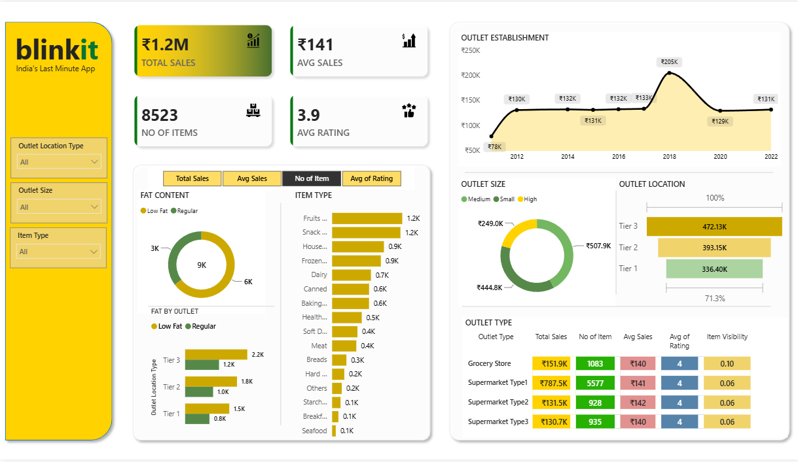

# 🛒 BlinkIT Grocery Sales Analysis

Created by Isha

An end-to-end Data Analytics project analyzing BlinkIT's grocery sales performance, customer ratings, and outlet-wise distribution using **Python, SQL, and Power BI**.

---

## 🚀 Project Overview

This project analyzes BlinkIT's grocery sales data to uncover insights around:

- Revenue Performance
- Item & Category-wise Sales
- Outlet Performance (Size, Location, Type, Establishment Year)
- Customer Rating Patterns
- Data Quality Issues in Raw Retail Data

The goal was to take a real-world, messy retail dataset and turn it into a clean, structured, and interactive Power BI dashboard capable of answering key business questions.

---

## 📂 Dataset Overview

The dataset contains **8,523 records** across **12 fields**, including:

- Item Identifier, Item Type, Item Weight, Item Visibility, Item Fat Content
- Outlet Identifier, Outlet Establishment Year, Outlet Size, Outlet Location Type, Outlet Type
- Sales, Rating

---

## 🛠️ Tools & Technologies

| Technology | Purpose |
|---|---|
| Python (Pandas, Matplotlib) | Data Cleaning & Exploratory Analysis |
| SQL | Business Query Analysis |
| Power BI | Dashboard Development |
| DAX | KPI & Measure Creation |

---

## 🔄 Project Workflow

### Stage 1: Data Cleaning (Python)

The raw dataset had a common real-world data quality issue: the `Item Fat Content` column contained inconsistent category labels representing the same value — `Low Fat`, `LF`, and `low fat` were all being treated as separate categories, as were `Regular` and `reg`.

Using Pandas, these inconsistent labels were identified and standardized into two clean categories: **Low Fat** and **Regular**. This step alone affected how every downstream KPI and chart (Sales by Fat Content, Fat Content by Outlet) was calculated — an uncleaned dataset would have fragmented and understated the "Low Fat" and "Regular" totals across multiple duplicate labels.

Additional steps performed in Python:
- Structural inspection (shape, dtypes, nulls)
- Exploratory visualizations (pie charts, bar charts, grouped bar charts, line charts) to validate trends before building the same views in Power BI

### Stage 2: Business & KPI Requirement Definition

Defined the core KPIs to track:
- Total Sales
- Average Sales
- Number of Items Sold
- Average Rating

And the chart-level business questions:
- Sales by Fat Content
- Sales by Item Type
- Fat Content by Outlet
- Sales by Outlet Establishment Year
- Sales by Outlet Size
- Sales by Outlet Location
- All Metrics by Outlet Type

### Stage 3: Power BI Dashboard Development

Built a single-page interactive dashboard with:
- KPI cards (Total Sales, Avg Sales, No. of Items, Avg Rating)
- Donut chart: Sales by Fat Content
- Horizontal bar chart: Sales by Item Type
- Grouped bar chart: Fat Content by Outlet Location Tier
- Line chart: Sales trend by Outlet Establishment Year
- Donut chart: Sales by Outlet Size
- Bar chart: Sales by Outlet Location (Tier 1/2/3)
- Matrix table: All metrics broken down by Outlet Type
- Slicers: Outlet Location Type, Outlet Size, Item Type

DAX measures created: Total Sales, Average Sales, No. of Items, Average Rating.

---

## 📊 Dashboard Preview

---

## 💡 Key Business Insights

- Total sales stood at **₹1.2M** across 8,523 items, with an average sale value of ₹141 and an average customer rating of 3.9.
- **Supermarket Type 1** outlets significantly outperform other outlet types in total sales, contributing the largest share of revenue.
- **Tier 3** locations generated the highest sales (₹472K) compared to Tier 2 (₹393K) and Tier 1 (₹336K), suggesting smaller-format/tier-3 outlets are not underperforming despite typically being assumed lower-priority markets.
- **Fruits & Vegetables** and **Snack Foods** are the top-performing item categories by sales, each contributing ~1.2K in item count and leading revenue share.
- Sales by outlet establishment year show a sharp rise after 2016, peaking around 2018 (₹205K), indicating newer outlets are driving disproportionate revenue.
- After merging inconsistent labels (`LF`/`low fat` → `Low Fat`, `reg` → `Regular`), the true sales split between Low Fat and Regular items became accurate — prior to cleaning, this comparison would have been misleading.

---

## 🎯 Skills Demonstrated

- Data Cleaning & Standardization
- Exploratory Data Analysis (Python)
- SQL Business Query Writing
- Power BI Dashboard Design
- DAX Measure Creation
- Data Storytelling & Insight Generation

---

## 📌 Note

This project was built as a structured, guided learning exercise to practice the full Data Analytics workflow (Python → SQL → Power BI). The core data cleaning, exploratory analysis, and final insights reflect my own hands-on work on the dataset.

---
